# ASA ACL to Meraki MX Conversion

This script takes a Cisco ASA ACL and converts the rules into compatible Meraki MX Rules. It'll build iterative or multi-source/multi-destination L3 based rules, and optionally will build out 1-1 NAT rules and L7 Deny Rules for outside -> inside rule sets. 
The choice of 1-1 NAT rules and L7 Deny rules assumes Inbound Rules are **NOT** enabled on the MX.

Supported ASA constructs: 
* Network Objects
* Network Object Groups
* Port Groups
* Protocol Groups

Unsupported ASA Constructs:
* Service Objects


**Warning**: This script assumes the target MX network is a new network. Existing L3 Rules, 1:1 NAT Rules, and L7 Rules will be replaced.


## Contacts
* Trevor Maco
* Matt Schmitz

## Solution Components
* ASA 
* Meraki

## Prerequisites

- **API Key**: In order to use the Meraki API, you need to enable the API for your organization first. After enabling API access, you can generate an API key. Follow these instructions to enable API access and generate an API key:
1. Login to the Meraki dashboard
2. In the left-hand menu, navigate to `Organization > Settings > Dashboard API access`
3. Click on `Enable access to the Cisco Meraki Dashboard API`
4. Go to `My Profile > API access`
5. Under API access, click on `Generate API key`
6. Save the API key in a safe place. The API key will only be shown once for security purposes, so it is very important to take note of the key then. In case you lose the key, then you have to revoke the key and a generate a new key. Moreover, there is a limit of only two API keys per profile.
> For more information on how to generate an API key, please click [here](https://developer.cisco.com/meraki/api-v1/#!authorization/authorization). 

> Note: You can add your account as Full Organization Admin to your organizations by following the instructions [here](https://documentation.meraki.com/General_Administration/Managing_Dashboard_Access/Managing_Dashboard_Administrators_and_Permissions).

- **ASA Config Files**: There are 2 ASA config files necessary for this code to run: the 'show run' file and the 'show access-list' file.

1. **'show run' file**: copy the output from the `show run` ASA command to a text file (named whatever you like). Move the text file to the code's root directory.
2. **'show access-list' file**: copy the output from the `show access-list` ASA command to a text file (named whatever you like). Move the text file to the code's root directory.

- **VLANs, Static Routes, and Addressing**: Source address rule imports will fail if the address/subnet does not exist on the target MX. To address this, follow these steps **BEFORE** running the code:
1. Enable `Routed` mode and `VLANs` on the MX.

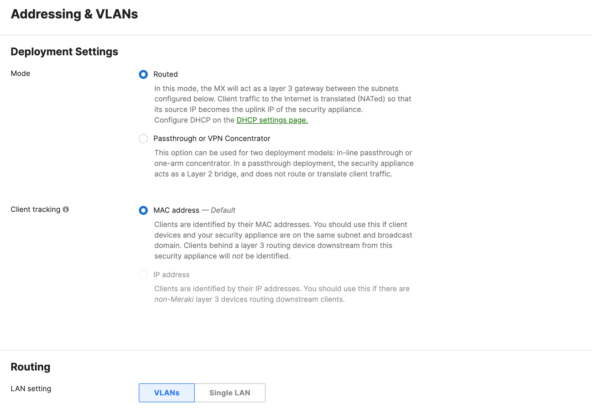

2. Create the proper VLAN's or Static routes on the dashboard which include each rule's source addresses. This can also be done in the `vlans.json` and `routes.json` files respectively > _see Usage section_


## Installation/Configuration
1. Clone this repository with `git clone [repository name]`
2. Add Meraki API key, Org Name, and MX Network name to the environment located in `config.py`
```python
MERAKI_API_KEY = "<API KEY>"
ORG_NAME = "<ORG>"
NETWORK_NAME = "<NETWORK>"
```
3. Add ACL Names to `config.py`, placing the appropriate ACLs in the `outbound_set` and the `nat_set` list. `outbound_set` corresponds to `Outbound Rules` in the Meraki Dashboard, and `nat_set` corresponds to 1:1 NAT and L7 Rule translation. If you are unsure where your ACL should go, consult Meraki's Firewall Rules configuration guide [here](https://documentation.meraki.com/MX/Firewall_and_Traffic_Shaping/MX_Firewall_Settings)
```python
ACL_TYPES = {
  "nat_set": ["ACL name"],
  "outbound_set": ["ACL name"]
}
```
3. Set up a Python virtual environment. Make sure Python 3 is installed in your environment, and if not, you may download Python [here](https://www.python.org/downloads/). Once Python 3 is installed in your environment, you can activate the virtual environment with the instructions found [here](https://docs.python.org/3/tutorial/venv.html).
4. Install the requirements with `pip3 install -r requirements.txt`

## Usage
1. To run the script, the main command is:
```python
python3 asa_to_mx.py -r show-run-file.txt -a show-access-list-file.txt
```

where _show-run-file.txt_ and _show-access-list-file.txt_ are the `show run` and `show access-list` files from the prerequisites section.

2. Optionally, you may specify `-v vlans.json` and/or `-s routes.json` if you'd like to configure your VLANs and Static routes in those files instead of the Meraki Dashboard. Please consult those files for proper formatting and examples.

3. The code will also prompt asking if you'd like `any translation` enabled. This feature translates source address 'any' into a subnet/group of subnets based on the subnet of the original ASA interface the ACL is attached to and any ASA routes configured. This is useful if you are importing multiple ACLs or have several subnets statically routed to a single interface to maintain the original ASA logic.

Once you start the script, it will begin creating ASA Objects for the MX, reading in the ACL Rules, translating the rules, and applying them to the Meraki MX Network.

**Note**: Lines which fail to translate are written to `unprocessed_rules.txt`. Consult this file if a rule is missing.

> Script Output:

Initial Prompts:


Creating VLANs if specified with `-v vlans.json`:

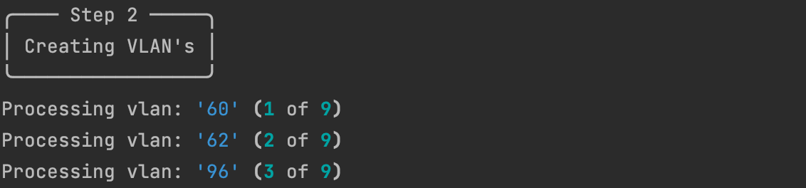

Creating Static routes if specified with `-s routes.json`:

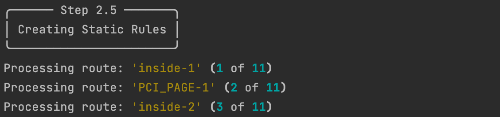

Parsing ACL Rules:

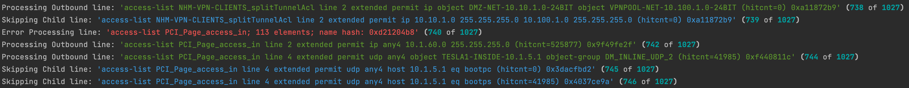

Results:

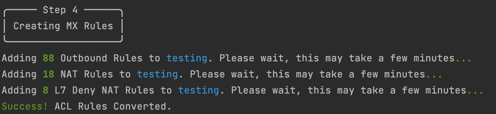


> Meraki Dashboard:

Initial Policy Objects:

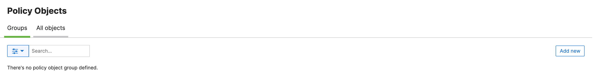

Initial Firewall Rules:

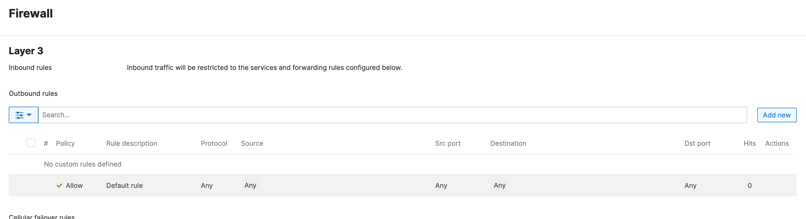

Initial NAT and L7 Rules:

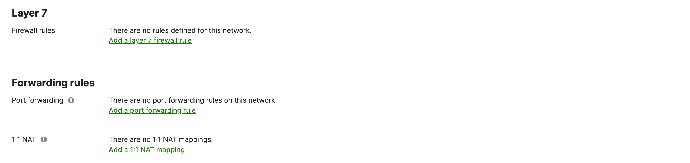

Policy Objects after creation:

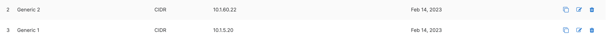

Policy Object Groups after creation:

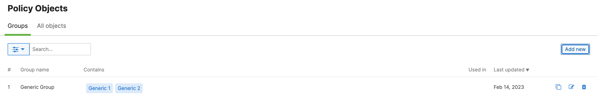

L3 Rules after creation:

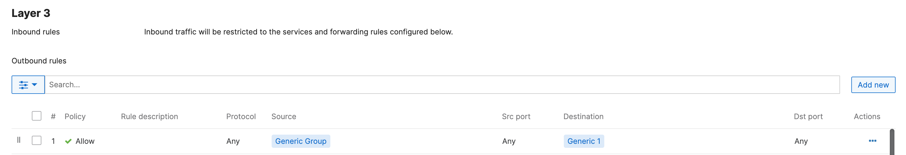

1-1 NAT Rules after creation:

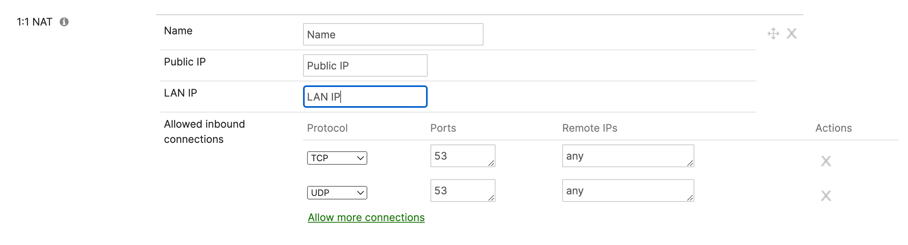

L7 Rules after creation:

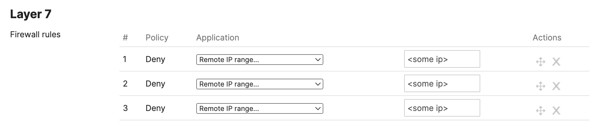


# Screenshots


### LICENSE

Provided under Cisco Sample Code License, for details see [LICENSE](LICENSE.md)

### CODE_OF_CONDUCT

Our code of conduct is available [here](CODE_OF_CONDUCT.md)

### CONTRIBUTING

See our contributing guidelines [here](CONTRIBUTING.md)

#### DISCLAIMER:
<b>Please note:</b> This script is meant for demo purposes only. All tools/ scripts in this repo are released for use "AS IS" without any warranties of any kind, including, but not limited to their installation, use, or performance. Any use of these scripts and tools is at your own risk. There is no guarantee that they have been through thorough testing in a comparable environment and we are not responsible for any damage or data loss incurred with their use.
You are responsible for reviewing and testing any scripts you run thoroughly before use in any non-testing environment.